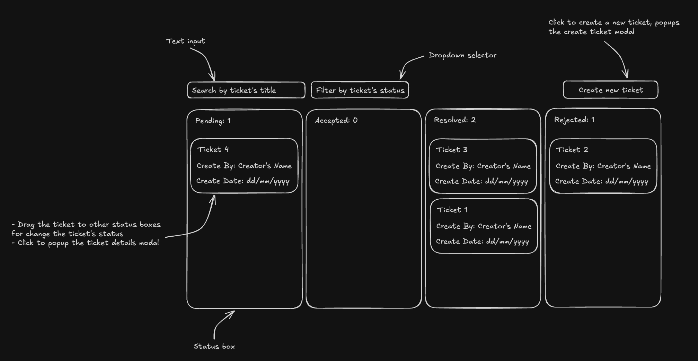
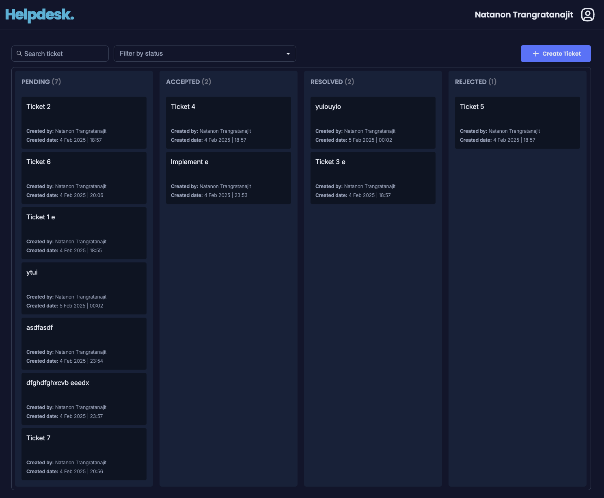
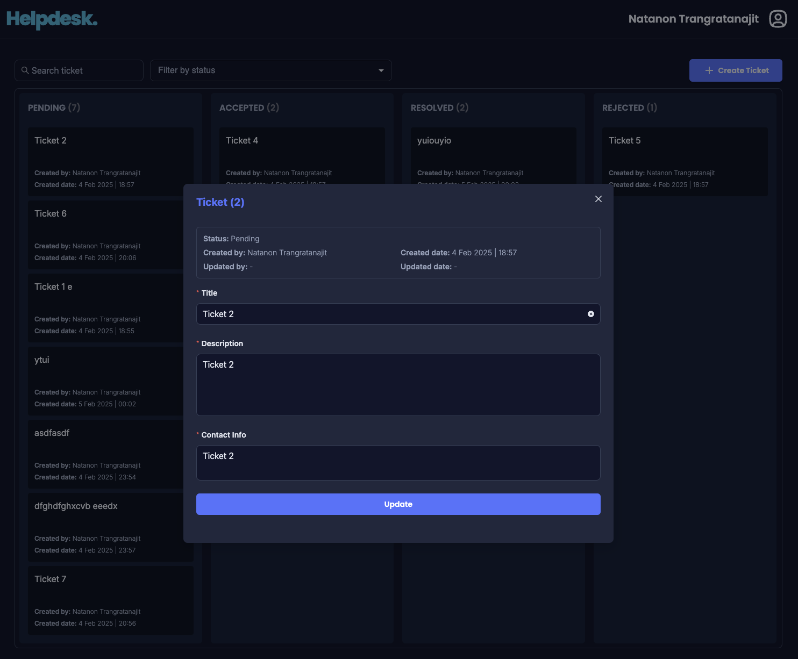
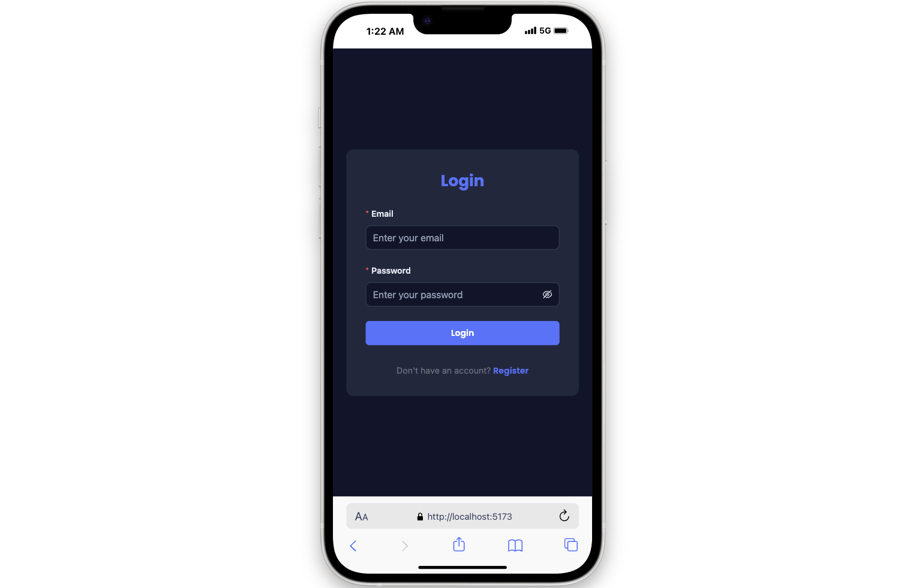
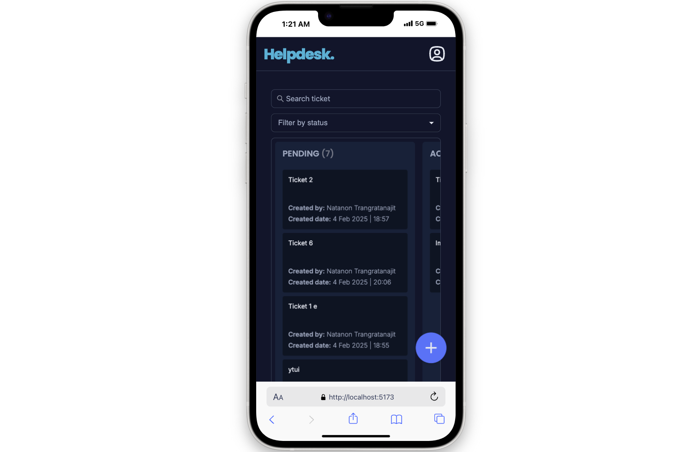

# Helpdesk Ticket Management System

This project is a **full-stack Helpdesk Ticket Management system** using:
- **Frontend:** React (Vite)
- **Backend:** Nest.js
- **Database:** PostgreSQL
- **Containerization:** Docker & Docker Compose

## How to Run the Project
### 1. **Clone the repository:**
```sh
git clone https://github.com/nuttnonn/helpdesk-app.git
cd helpdesk-app
```

### 2. **Add .env file:**
Create .env file for the frontend and backend at each root.


### 3. **Run the project using Docker Compose:**
```sh
docker compose up --build -d
```
   
   
### 4. **Access the services:**
- **Frontend (React):** http://localhost:5173
- **Backend API (Nest.js):** http://localhost:3000


## Kanban Board Design



## App Preview
<p align="center">
  
  
</p>


## Responsive Design
<p align="center">
  
  
</p>